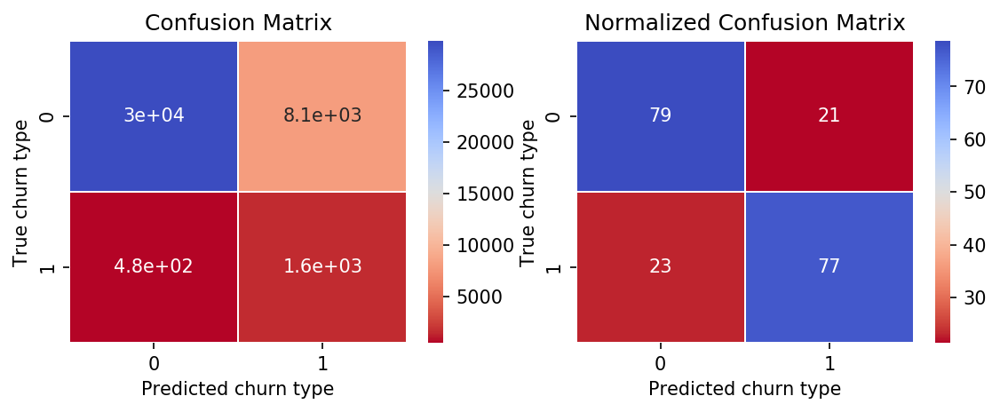
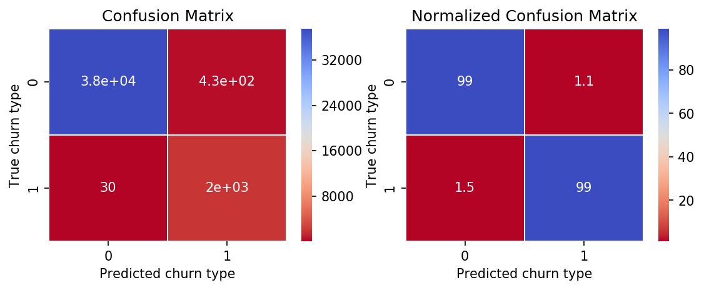

# One Month Churn

This is a script that predicts whether or not a customer will churn or not after 30 days. The csv data files provided include a training (labeled: whether the customer churned or not) 'dataset_train.csv' and test (unlabeled) 'dataset_test.csv' set. Otherwise, the names of features of the datasets are unknown. However, it is apparent that some of the features are categorical in the midst of mostly continuous features.

## Getting Started

These instructions will get you a copy of the project up and running on your local machine for development and testing purposes.

### Prerequisites

This project only requires a base installation of Python 3.5, numpy, pandas, sklearn, matplotlib, and seaborn.

## Comments on the data

I chose to model the data using two different algorithms since we do not know whether the decision boundary is linear or non-linear: logistic regression and random forest. Since the dataset is imbalanced (5.15% monthly churn), I chose to train by optimizing the F1-score instead of accuracy. 

To better deal with class imablance of the churn rate, for both algorithms, class weights were 'balanced'. Other hyperparamters selected with GridSearchCV. The set of hyperparamterers that maximized the F1-score was chosen as the best classifier. Training was performed with 10-fold cross validation.

Data was initially scaled using the StandardScaler for logistic regression only but for both classifiers, categorical features were one-hot encoded. 

## Expected results

In the plots/ directory, the following images of confusion matrices should appear:

Logisitic regression classifier:

Random forest classifier:

## Authors

* **Jason Boulet** - *Initial work* - [far-from-normal](https://github.com/far-from-normal)

## License

This project is licensed under the MIT License.